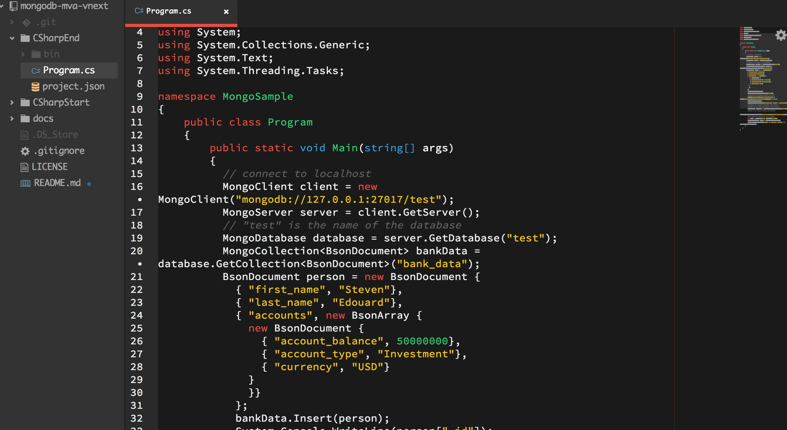

#MongoDB MVA C# files in vNext

This is a small, companion project to [sedouard/mongodb-mva](https://github.com/sedouard/mongodb-mva) repository for Microsoft Virtual Academy **C#**/**MongoDB** examples rewritten to run in **vNext** **KRE** on OS X/Yosemite (or any other **KRE** supported system). R&D-ed and written while watching Module 4 of this online course: 
[You've Got Documents! A MongoDB Jump Start](http://www.microsoftvirtualacademy.com/training-courses/you-ve-got-documents-a-mongodb-jump-start) from @MSVirtAcademy. 

I love MongoDB and use C# at work in my company.  I've already got certificate for NodeJS and MongoDB - but had no previous experience with **C#** and **MongoDB** combo.

I assume that you know what **vNext** is: [https://github.com/aspnet/home](https://github.com/aspnet/home)

I hope you'll find this useful. 

##Projects

* [CSharpStart](CSharpStart)
* [CSharpEnd](CSharpEnd)

##Projects Description

* [CSharpStart](#csharpstart)
* [CSharpEnd](#csharpend)

##What's inside

###CSharpStart


This is **vNext** version of C# console application boilerplate Visual Studio project you can see on original repository [here](https://github.com/sedouard/mongodb-mva/tree/master/module3_language_drivers/CSharpStart).

The project was scaffolded with @Yeoman [generator-aspnet](https://github.com/OmniSharp/generator-aspnet) tool.

You could read more about **generator-aspnet** on MSDN blog below:

[Yeoman generators for ASP.NET 5](http://blogs.msdn.com/b/webdev/archive/2014/12/17/yeoman-generators-for-asp-net-vnext.aspx)

To recreate this project boilerplate when starting blank slate project you should follow below steps.

####Install @Yeoman:  

See: [Yeoman's getting started](http://yeoman.io/learning/)

####Install [generator-aspnet](https://github.com/OmniSharp/generator-aspnet)  

```
npm install -g generator-aspnet
```
####Scaffold *console* type of **vNext** project

```
yo aspnet

     _-----_
    |       |    .--------------------------.
    |--(o)--|    |      Welcome to the      |
   `---------´   |   marvellous ASP.NET 5   |
    ( _´U`_ )    |        generator!        |
    /___A___\    '--------------------------'
     |  ~  |     
   __'.___.'__   
 ´   `  |° ´ Y ` 

? What type of application do you want to create? (Use arrow keys)
❯ Console Application 
  Web Application 
  MVC Application 
  Nancy ASP.NET Application 
  Class Library 
```

####Add MongoDB C# driver dependency

Go to your project directory and add **MongoDB** C# driver dependency using **K Package Manager**:

```
kpm install mongocsharpdriver
GET https://www.nuget.org/api/v2/FindPackagesById()?Id='mongocsharpdriver'.
[...]
Installing mongocsharpdriver 1.10.0-rc0
Restore complete, 2649ms elapsed
```

####Fine tune your project file

Things to watch are usually `namespace` of your generated classes, `project.json` configuration, etc.

####Build and run your project

```
kpm build
[...]
Build succeeded.
    0 Warnings(s)
    0 Error(s)

Time elapsed 00:00:01.3558733
k run
```

###CSharpEnd

This project starts exactly from **CSharpStart** boilerplate project. You could follow the same steps to recreate *blank slate* for this one and then add content to `Program.cs` as you need.



**[BUMMER]** Running project *as is* without changes in generated dependencies will fail (at least at the time of writing). Thanks to Victor Hurdugaci (@VictorHurdugaci on @Twitter): [https://twitter.com/victorhurdugaci/status/548493405220007937](https://twitter.com/victorhurdugaci/status/548493405220007937) for solution. `project.json` has been modified to not have reference to `aspnetcore50` framework.
> VictorHurdugaci: @blazejewicz Try to remove the aspnetcore50 target configuration from project.json


####Build and run your project

#####Install dependencies
```
kpm restore
Restoring packages for /Users/piotrblazejewicz/git/mongodb-mva-vnext/CSharpEnd/project.json
[...]
Resolving complete, 167ms elapsed
Restore complete, 170ms elapsed
```
#####Build/compile
```
kpm build

Building CSharpEnd for Asp.Net,Version=v5.0
  Using Project dependency CSharpEnd 1.0.0
[...]
Build succeeded.
    0 Warnings(s)
    0 Error(s)

Time elapsed 00:00:01.8840093
```

#####[optional] Make sure that your local MongoDB server is running:

```
mongod
mongod --help for help and startup options
2014-12-26T16:17:31.056+0100 [initandlisten] MongoDB starting : pid=19170 port=27017 dbpath=/data/db 64-bit host=peter
[...]
```

#####Run program
```
k run
549d7c6551dc304af5c1d5f6
Successfully updated 1 document.
50100000
number of documents removed: 1
```
