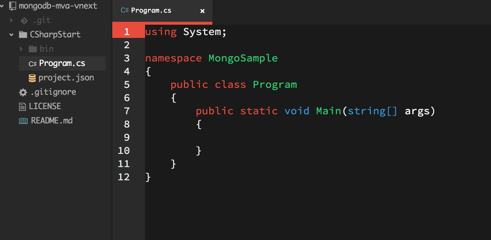

# MongoDB MVA C# files in vNext
===========================

:bear: Side project to sedouard/mongodb-mva of Microsoft Virtual Academy for C# MongoDB examples rewritten to run in vNext KRE

##Contents

* [CSharpStart](CSharpStart)
* [CSharpEnd](CSharpEnd)

##What's inside

###CSharpStart



This is **vNext** version of C# console application boilerplate Visual Studio project you can see on original repository [here](https://github.com/sedouard/mongodb-mva/tree/master/module3_language_drivers/CSharpStart).

The project was scaffolded with @Yeoman [generator-aspnet](https://github.com/OmniSharp/generator-aspnet) tool. To recreate this project boilerplate when starting blank slate project you should follow below steps.

####Install @Yeoman:  

See: [Yeoman's getting started](http://yeoman.io/learning/)

####Install [generator-aspnet](https://github.com/OmniSharp/generator-aspnet)  

```
npm install -g generator-aspnet
```
####Scaffold *console* type of **vNext** project

```
yo aspnet

     _-----_
    |       |    .--------------------------.
    |--(o)--|    |      Welcome to the      |
   `---------´   |   marvellous ASP.NET 5   |
    ( _´U`_ )    |        generator!        |
    /___A___\    '--------------------------'
     |  ~  |     
   __'.___.'__   
 ´   `  |° ´ Y ` 

? What type of application do you want to create? (Use arrow keys)
❯ Console Application 
  Web Application 
  MVC Application 
  Nancy ASP.NET Application 
  Class Library 
```

####Add MongoDB C# driver dependency

Go to your project directory and add **MongoDB** C# driver dependency using **K Package Manager**:

```
kpm install mongocsharpdriver
GET https://www.nuget.org/api/v2/FindPackagesById()?Id='mongocsharpdriver'.
[...]
Installing mongocsharpdriver 1.10.0-rc0
Restore complete, 2649ms elapsed
```

####Fine tune your project file

Things to watch are usually `namespace` of your generated classes, `project.json` configuration, etc.

####Build and run your project

```
kpm build
[...]
Build succeeded.
    0 Warnings(s)
    0 Error(s)

Time elapsed 00:00:01.3558733
k run
```

###CSharpEnd

This project starts exactly from **CSharpStart** boilerplate project. You could follow the same steps to recreate *blank slate* for this one.

**[BUMMER]** At this point building the project under vNext fails - probably due to MongoDB C# driver incompatibility with vNext [investigating]:

```
kpm build

Building CSharpEnd for Asp.Net,Version=v5.0
  Using Project dependency CSharpEnd 1.0.0
    Source: /Users/piotrblazejewicz/git/mongodb-mva-vnext/CSharpEnd/project.json

  Using Package dependency mongocsharpdriver 1.10.0-rc0
    Source: /Users/piotrblazejewicz/.kpm/packages/mongocsharpdriver/1.10.0-rc0
    File: lib/net35/MongoDB.Bson.dll
    File: lib/net35/MongoDB.Driver.dll
[...]
 Using Package dependency System.Threading.Tasks 4.0.10-beta-22231
    Source: /Users/piotrblazejewicz/.kpm/packages/System.Threading.Tasks/4.0.10-beta-22231
    File: lib/contract/System.Threading.Tasks.dll

/Users/piotrblazejewicz/git/mongodb-mva-vnext/CSharpEnd/Program.cs(1,7): error CS0246: The type or namespace name 'MongoDB' could not be found (are you missing a using directive or an assembly reference?)
/Users/piotrblazejewicz/git/mongodb-mva-vnext/CSharpEnd/Program.cs(2,7): error CS0246: The type or namespace name 'MongoDB' could not be found (are you missing a using directive or an assembly reference?)
/Users/piotrblazejewicz/git/mongodb-mva-vnext/CSharpEnd/Program.cs(14,11): error CS0246: The type or namespace name 'MongoClient' could not be found (are you missing a using directive or an assembly reference?)
/Users/piotrblazejewicz/git/mongodb-mva-vnext/CSharpEnd/Program.cs(14,36): error CS0246: The type or namespace name 'MongoClient' could not be found (are you missing a using directive or an assembly reference?)

Build failed.
    0 Warnings(s)
    4 Error(s)

Time elapsed 00:00:01.3120005
```

